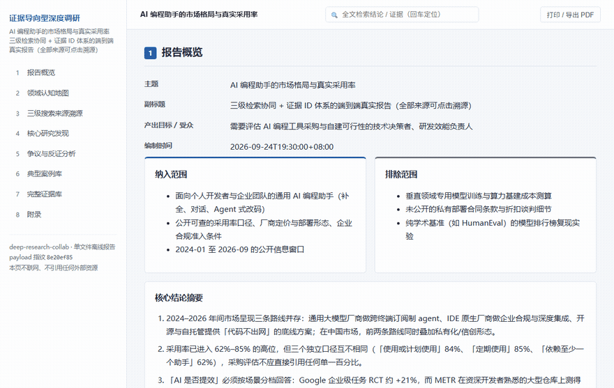

<sub>🌐 <b>中文</b></sub>

<div align="center">

# deep-research-collab · 证据导向型深度调研协同

> *「调查报告最贵的不是结论，是你不敢信它。」*

[](skills/deep-research-collab/SKILL.md)
[](https://skills.sh/herong113/deep-research-collab)
[](LICENSE)

**把「一堆搜来的说法」变成「每个结论都能点回原文的证据链」——同时交付可归档的 Markdown 与可演示的单文件离线 HTML。**

[看效果](#效果示例) · [安装](#快速开始) · [触发方式](#触发方式) · [它和同类有什么不同](#它和同类有什么不同) · [安全边界](#安全边界)

</div>

---



---

## 它解决什么问题

你让 AI 研究一个行业，它给你一篇读起来很顺的报告。然后你问：「这个数字哪来的？」——答不上来。

事情是这样的：模型的训练记忆是**旧**的，而它写起来又是**自信**的。于是「看起来完整」和「真的查过」之间，隔着一整条证据链。等你发现某个关键数据是二手的、某个百分比没有口径、某个结论只有一个来源在支撑，报告已经发出去了。

这个技能换了个思路：**先证据，后结论**。每个结论在证据库里必须能找到 ≥2 个相互独立的来源，否则它只能被写成「待验证观察」，不许被写成结论。争议点必须正反证据并列，只找到一边就不许输出该小节。缺口补不上就回退补搜，到上限就如实标缺口——而不是用「业内普遍认为」绕过去。

最后给你两份东西：一份能进版本库的 Markdown，一份**双击就能打开、不联网也能看、图表是内联 SVG** 的单文件 HTML。

## 效果示例

`skills/deep-research-collab/examples/report-sample.html` —— **一份真实跑出来的报告**（主题：AI 编程助手的市场格局与真实采用率），不是摆拍样例：

- **16 条证据、14 个真实独立域名**，全部可点击溯源：Stack Overflow 调查、JetBrains 开发者生态报告、GitHub Octoverse、METR 的两份 RCT 及其自我更正、Google DORA 报告、arXiv 企业级 RCT、Cursor / Anthropic / Tabby 官方页，以及阿里云通义灵码、腾讯云 CodeBuddy 官方文档与中文媒体。
- 单文件、**零外部依赖**（无 CDN、无在线字体、无外链脚本），断网可完整打开，图表全部内联 SVG。
- 含 8 个模块：报告概览 / 领域认知地图 / 三级搜索来源溯源 / 核心研究发现 / 争议与反证分析 / 典型案例库 / 完整证据库 / 附录。
- 报告里的**分歧结论原样保留**：Google 企业 RCT 约 +21% 提速 vs METR 测得 −19% 减速 vs DORA 组织级吞吐 −1.5%、稳定性 −7.2%，并注明 METR 已公开自我更正称其后续数据不可靠。三条争议都写明了「为什么未决」。
- **典型案例库为空**——本轮没有找到可核验的真实落地案例，所以不写，而不是编一条时间线凑数。
- 附录逐条列明 **8 项未取得的证据**（主检索引擎配额耗尽、微信公众号原文仅得聚合页、多份行业报告 403/人机验证等）。

它由 `examples/example-report-payload.json` 经 `scripts/build_report.py --strict` 生成，**同一 payload 两次生成逐字节一致**——你可以自己复现：

```bash
python skills/deep-research-collab/scripts/build_report.py \
  --payload skills/deep-research-collab/examples/example-report-payload.json \
  --out /tmp/report.html --strict
```

## 快速开始

```bash
npx skills add herong113/deep-research-collab
```

装完对 Agent 说：

```text
帮我系统研究一下国内 AI 编程助手这个赛道，我要给团队做技术选型前的判断，每个结论都要有来源。
```

需要 PDF 时，用系统自带 Chrome 打印：

```bash
chrome --headless=new --print-to-pdf=report.pdf report.html
```

## 触发方式

以下都是本技能触发评测集里 `should-trigger` 的**真实用户说法**：

- 帮我系统研究一下国内 AI 编程助手这个赛道，我要给团队做技术选型前的判断，每个结论都要有来源。
- 我要做一个面向中小企业的财税课程，先搞清楚这个领域的真实痛点和已有课程格局，最后给我一份能演示的报告。
- 把「AI Agent 在企业落地的真实渗透率」这个课题做一次深度调研，正反观点都要，能点开来源的那种。
- 行业全景研究：国内储能行业的政策、玩家、技术路线，要带图表的报告。
- 研究一下这个领域，我不确定该怎么切分，你先给我一个研究框架和边界，确认后再往下做。
- 帮我把这半年关于这个赛道的公开信息做一次交叉验证，看看哪些说法站得住。

**什么时候不该用它**（`should-not-trigger`）：单点事实查询、一次网页检索、新闻摘要、翻译润色、写代码、装插件——这些用普通检索或 `tavily-research`。**输入已经是成品材料**（如「把这份 PDF 总结一下」）也不触发。

## 能做什么 / 它会交付什么

| 能力 | 交付物 |
|---|---|
| 三级检索协同（广度发现 → 深度核对 → 缺口反证） | `01-candidate-sources.md`、`02-evidence-v1.0/v2.0.md` |
| 证据 ID 体系（每条含原文片段 / 可信度 / 层级 / 工具 / 提取时间） | `证据库.json`、`03-cognition-map-*.md` |
| 正反证据并列与缺口回退 | `04-counterevidence.md` |
| 双格式输出 + 一致性校验 | `report.md`、`payload.json`、`report.html` |
| 可归档 + 可复查 | `archive/` + 运行记录（含写回决策） |

## 它和同类有什么不同

| 维度 | 常见同类做法 | 本技能 |
|---|---|---|
| 检索来源 | 单一检索 API 或纯英文/学术后端 | **中文域三级协同**：Tavily + 秘塔，含微信公众号定向（`site:mp.weixin.qq.com`）与"不可得路径"记录 |
| 证据模型 | 报告里挂链接 | **独立证据卡**：`EV-xxx` + 逐字原文片段 + 可信度 + 独立性判定；报告内每个 `[EV-00X]` 必须能在证据库命中 |
| 可视化 | CSS + 目录 | **内联 SVG 图表 + 思维导图 + 正反对置面板 + 流程追溯图（带回退次数）** |
| 交付物 | 一份 Markdown | **双产物**：Markdown（归档）+ 单文件离线 HTML（演示），并要求双版逐节一致 |
| 门禁 | 文字规范 | **可执行**：`--strict` 遇悬空证据引用 / 无证据结论 / 独立来源不足即 `exit 1` **且不写出任何 HTML** |
| 失败模式 | 无 | 每个 `references/` 与 `assets/` 文件开头都写明**它防止的失败模式**；9 条 Hard Stops |

诚实说明：**本技能不声称"找到的来源比普通检索更好"**。它的可证明优势是**可核查结构**。这条来自一次真实基线对比——`without-skill` 基线在来源质量上并不逊色，甚至找到了本技能漏掉的两个高质量来源。该反证已记录在 `evals/acceptance/runs/2026-09-16-ai-coding-assistant/`，未被隐去。

## 安全边界

- **不联网渲染**：HTML 报告零外部依赖（无 CDN、无在线字体、无外链脚本），断网可完整打开。
- **不越界写入**：脚本只在 `--out` 指定的路径写文件；校验脚本是只读的。
- **不伪造来源**：拿不到原文就标 `不可得路径` 并降级可信度；**禁止**把"未检索到"写成"不存在"。
- **不泄露凭据**：仓库内不含 API key / token / 本机绝对路径。
- **会在这些点停下来问你**：需求对齐卡未确认、判定"不值得做"、争议点只有单边证据、准备新增外部 API 调用时。

## 文件结构

```text
deep-research-collab/
├── README.md                      # 本文件
├── LICENSE                        # MIT
├── CHANGELOG.md                   # 为什么改，不只是改了什么
├── assets/demo.gif                # 30 秒滚动演示（含可复现录制脚本）
└── skills/deep-research-collab/
    ├── SKILL.md                   # 路由面：触发边界 / 五阶段 / 资源路由 / 硬停止 / 验收
    ├── references/                # 12 个细则文件（检索流程、证据模型、发布门禁、闭环治理…）
    ├── assets/                    # 12 个模板（对齐卡、领域简报、报告模板、payload 模板…）
    ├── scripts/                   # 生成器 + 4 个门禁 + verify-all.py 单一入口
    ├── examples/                  # 样例输入 / 输出 / payload / 可打开的报告
    └── evals/                     # 触发评测 18 例 + 一次完整 acceptance run
```

## 验证与测试

一条命令跑完全部门禁（stdlib，无第三方依赖，Windows / macOS / Linux 通用）：

```bash
python skills/deep-research-collab/scripts/verify-all.py
```

期望输出（全通过时退出码 0）：

```text
== 1/4 结构门禁 ==
  [PASS] 包结构完整（必需文件齐备）
  [PASS] 闭环治理契约
== 2/4 验收运行门禁 ==
  [PASS] 验收运行 evals\acceptance\runs\2026-09-16-ai-coding-assistant
== 3/4 报告生成（--strict）==
  [PASS] --strict 校验（引用不存在的 EV / 结论无证据 / 独立来源不足即失败）
== 4/4 可复现性 ==
  [PASS] 同一 payload 两次生成逐字节一致
== 结论：5/5 项通过 ==
```

**它会真的失败**（不是装饰）：把样例 payload 里任一证据的 `id` 改掉、留下悬空的 `EV` 引用，`--strict` 会以 `exit 1` 终止并**不写出任何 HTML**。

## 致谢

本技能的阶段划分与"每个文件写明它防止的失败模式"的写法，受 [LearnPrompt/luban-skill](https://github.com/LearnPrompt/luban-skill)（鲁班 · Skill 打磨工坊）的「验料 / 访行 / 过尺 / 慢刨 / 回炉」方法论影响。Agent Skills 开放格式见 [agentskills.io](https://agentskills.io/home)。

## License

[MIT](LICENSE)

---

<div align="center">

*先证据，后结论。*

</div>
